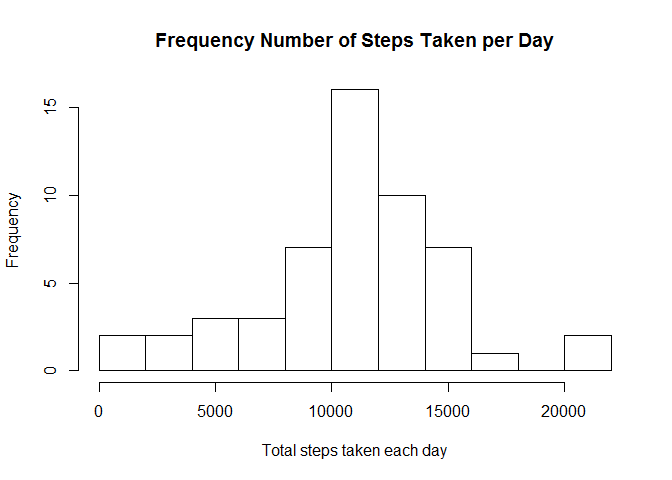
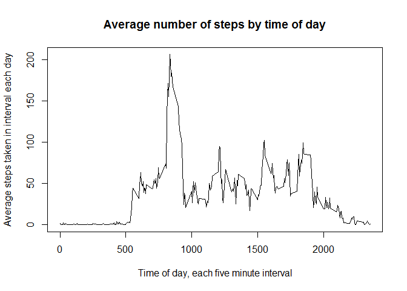
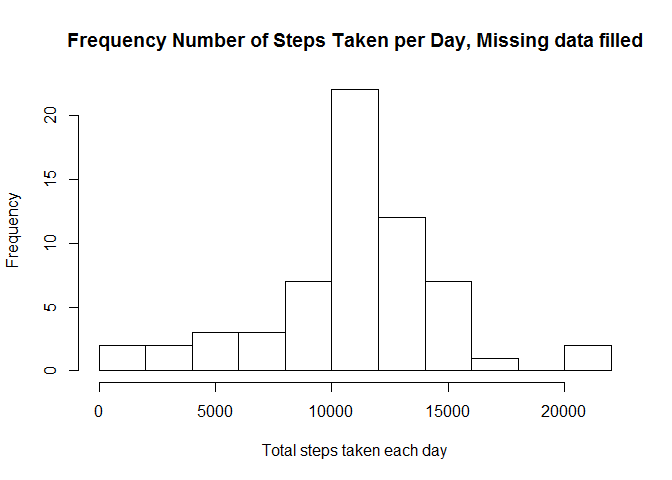
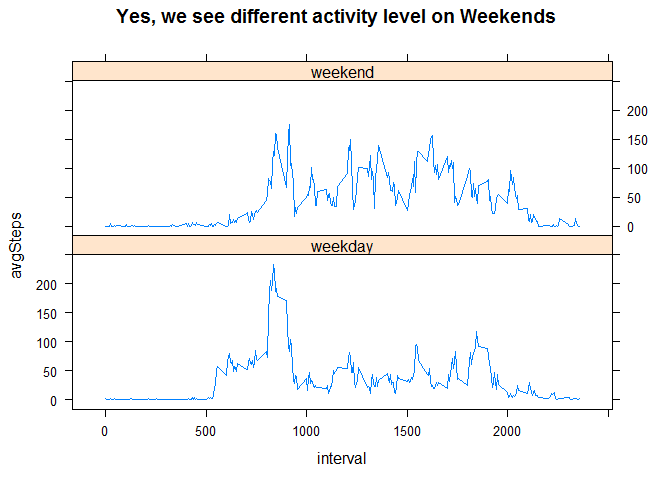

#### load appropriate libraries

```r
library(dplyr)
```

```
## Warning: package 'dplyr' was built under R version 3.3.3
```

```r
library(lattice)
```

```
## Warning: package 'lattice' was built under R version 3.3.3
```
##   Loading and preprocessing the data
####  first we set the working directory

```r
setwd("C:/rProjects/repResearch/RepData_PeerAssessment1")
```

####  now read in the data

```r
dat1 <- read.csv("activity.csv")
```

#### clean up some formats and create some variables for future work 

```r
dat1$date <- as.Date(dat1$date, "%Y-%m-%d")
dat1$wday <- weekdays(dat1$date)
dat1$wdwe <- ifelse(dat1$wday %in% c("Saturday", "Sunday"), "weekend", "weekday")
dat1$N <- seq(1, 17568, by=1)
```

##  What is mean total number of steps taken per day?
#### first calculate the total number of steps taken each day to the dataframe dSumstep
#### create a histogram to show the distribution of steps taken each day
#### the average total number of steps taken per day is 10,767, and the median is 10,765.   

```r
dSumstep <- as.data.frame(dat1 %>% group_by(date) %>% summarize(sumSteps = sum(steps)))
hist(dSumstep$sumSteps,  nclass=10, main="Frequency Number of Steps Taken per Day", xlab = "Total steps taken each day")
```

<!-- -->

```r
mean(dSumstep$sumSteps, na.rm = TRUE)
```

```
## [1] 10766.19
```

```r
median(dSumstep$sumSteps, na.rm = TRUE)
```

```
## [1] 10765
```

```r
summary(dSumstep$sumSteps, na.rm = TRUE)
```

```
##    Min. 1st Qu.  Median    Mean 3rd Qu.    Max.    NA's 
##      41    8841   10760   10770   13290   21190       8
```

## What is the average daily activity pattern?
#### there are 288 five minute intervals each day, looks like our individual is active in the
#### morning taking the most steps, 206.2, on average at interval 835 

```r
iAvgstep <- as.data.frame(dat1 %>% group_by(interval) %>% summarize(avgSteps = mean(steps, na.rm = TRUE)))
plot(iAvgstep$interval, iAvgstep$avgSteps, type="l", main = "Average number of steps by time of day",
      xlab = "Time of day, each five minute interval", ylab = "Average steps taken in interval each day")
```

<!-- -->

```r
iAvgstep <- mutate(iAvgstep, cdist = dplyr::cume_dist(iAvgstep$avgSteps) )
iAvgstep[iAvgstep$cdist == 1,]
```

```
##     interval avgSteps cdist
## 104      835 206.1698     1
```

## Imputing missing values
#### the total number of missing values in the dataset is 2,304 of 17,568 observations, or about 13%

```r
sum(is.na(dat1$steps))
```

```
## [1] 2304
```

```r
sum(is.na(dat1$steps))/length(dat1$steps)
```

```
## [1] 0.1311475
```
#### to impute the missing values i'll use the average by weekday or weekend, and the interval to
#### fill missing values, first compute the average by day type and interval

```r
iwAvgstep <- as.data.frame(dat1 %>% group_by(interval, wdwe) %>% summarize(avgSteps = mean(steps, na.rm = TRUE)))
head(iwAvgstep)
```

```
##   interval    wdwe  avgSteps
## 1        0 weekday 2.3333333
## 2        0 weekend 0.0000000
## 3        5 weekday 0.4615385
## 4        5 weekend 0.0000000
## 5       10 weekday 0.1794872
## 6       10 weekend 0.0000000
```

```r
tail(iwAvgstep)
```

```
##     interval    wdwe  avgSteps
## 571     2345 weekday 0.2051282
## 572     2345 weekend 1.8571429
## 573     2350 weekday 0.3076923
## 574     2350 weekend 0.0000000
## 575     2355 weekday 1.4615385
## 576     2355 weekend 0.0000000
```
#### now join the average in each observation of the entire data set and find the missing values

```r
dat2 <- left_join(dat1, iwAvgstep, by = c("wdwe" = "wdwe", "interval" = "interval") )
dat2$fill <- is.na(dat2$steps)
```
#### now overwrite only the missing values in column 1, the steps with column 7 the average steps
#### and then check a few observations where data changed from missing to existing

```r
dat2[dat2$fill==TRUE, 1] <- dat2[dat2$fill==TRUE, 7]
dat2[c(284:293),]
```

```
##         steps       date interval    wday    wdwe   N  avgSteps  fill
## 284 1.8717949 2012-10-01     2335  Monday weekday 284 1.8717949  TRUE
## 285 2.0769231 2012-10-01     2340  Monday weekday 285 2.0769231  TRUE
## 286 0.2051282 2012-10-01     2345  Monday weekday 286 0.2051282  TRUE
## 287 0.3076923 2012-10-01     2350  Monday weekday 287 0.3076923  TRUE
## 288 1.4615385 2012-10-01     2355  Monday weekday 288 1.4615385  TRUE
## 289 0.0000000 2012-10-02        0 Tuesday weekday 289 2.3333333 FALSE
## 290 0.0000000 2012-10-02        5 Tuesday weekday 290 0.4615385 FALSE
## 291 0.0000000 2012-10-02       10 Tuesday weekday 291 0.1794872 FALSE
## 292 0.0000000 2012-10-02       15 Tuesday weekday 292 0.2051282 FALSE
## 293 0.0000000 2012-10-02       20 Tuesday weekday 293 0.1025641 FALSE
```

```r
dat2[c(9790:9799),]
```

```
##         steps       date interval     wday    wdwe    N avgSteps  fill
## 9790 0.000000 2012-11-03     2345 Saturday weekend 9790 1.857143 FALSE
## 9791 0.000000 2012-11-03     2350 Saturday weekend 9791 0.000000 FALSE
## 9792 0.000000 2012-11-03     2355 Saturday weekend 9792 0.000000 FALSE
## 9793 0.000000 2012-11-04        0   Sunday weekend 9793 0.000000  TRUE
## 9794 0.000000 2012-11-04        5   Sunday weekend 9794 0.000000  TRUE
## 9795 0.000000 2012-11-04       10   Sunday weekend 9795 0.000000  TRUE
## 9796 0.000000 2012-11-04       15   Sunday weekend 9796 0.000000  TRUE
## 9797 0.000000 2012-11-04       20   Sunday weekend 9797 0.000000  TRUE
## 9798 3.714286 2012-11-04       25   Sunday weekend 9798 3.714286  TRUE
## 9799 0.000000 2012-11-04       30   Sunday weekend 9799 0.000000  TRUE
```
#### the new average total number of steps taken per day changed slightly to  10,762, and the median is now 10,571.   

```r
dSumstep <- as.data.frame(dat2 %>% group_by(date) %>% summarize(sumSteps = sum(steps)))
hist(dSumstep$sumSteps,  nclass=10, main="Frequency Number of Steps Taken per Day", xlab = "Total steps taken each day")
```

<!-- -->

```r
mean(dSumstep$sumSteps, na.rm = TRUE)
```

```
## [1] 10762.05
```

```r
median(dSumstep$sumSteps, na.rm = TRUE)
```

```
## [1] 10571
```

```r
summary(dSumstep$sumSteps, na.rm = TRUE)
```

```
##    Min. 1st Qu.  Median    Mean 3rd Qu.    Max. 
##      41    9819   10570   10760   12810   21190
```

## Are there differences in activity patterns between weekdays and weekends?
#### when imputing missing values we assumed there would be differences in activity level on the weekends
#### now we'll check this out, we create a new data frame with the average steps by interval and day type
#### our subject moves around less early, but does get more active in the middle of the day and later at night

```r
iwAvgstep <- as.data.frame(dat2 %>% group_by(interval, wdwe) %>% summarize(avgSteps = mean(steps, na.rm = TRUE)))
xyplot(avgSteps ~ interval | wdwe, data=iwAvgstep, type="l", layout = c(1, 2), main="Yes, we see different activity level on Weekends")
```

<!-- -->
